<!--
  Profile README for github.com/Hamna12
  Custom art is self-generated SVG (no plugins): hero.svg + wordmark.svg animate
  via SMIL; contrib-heatmap.svg refreshes daily via the GitHub Action in
  .github/workflows/update-profile-art.yml. Live stat cards below are themed to
  match. Regenerate static art:
    python scripts/make_hero_svg.py hero.svg
    python scripts/make_wordmark_svg.py wordmark.svg
-->

  

  

 

## `> whoami`

I'm an AI engineer and researcher from Pakistan. I build AI systems, explore agents and robotics, and learn out loud.

I care about AI that helps people think and decide better, not just generate answers. So confidence and knowing when a model is wrong matter to me a lot.

I share the wins. I also share the parts that broke.

 

## `> currently exploring`

Right now my focus is on a few things:

- **AI agents and multi-agent systems.** Getting models to plan, use tools, and work together instead of answering in one shot.
- **Robotics learning.** I start in simulation with Webots before touching hardware, then bring lessons back to small ESP32 builds.
- **RAG and LLM apps** with a real backend behind them, not just a demo.
- **Data science and ML**, which is the foundation under all of it.

Simulation first, then hardware. That order has saved me a lot of time and money.

 

## `> tech stack`

&nbsp;&nbsp;
&nbsp;&nbsp;
&nbsp;&nbsp;
&nbsp;&nbsp;
&nbsp;&nbsp;
&nbsp;&nbsp;
&nbsp;&nbsp;
&nbsp;&nbsp;
&nbsp;&nbsp;
&nbsp;&nbsp;
&nbsp;&nbsp;

**Also working with:**
&nbsp;LLMs · RAG · AI agents · multi-agent systems · FastAPI · Streamlit · Webots · ROS2 · ESP32

 

## `> a note on how I work`

I try to build things that are useful, not just impressive. A small tool that solves a real problem beats a flashy demo that goes nowhere.

I also think AI literacy is becoming as basic as computer literacy was twenty years ago. You don't have to be an engineer. But it helps to know how these systems work, where they fail, and how to use them well.

If any of this overlaps with what you're working on, reach out. I like comparing notes.

 

<code>hamna@dev:~$</code> built with curiosity, and a little help from Bismillah 🤍

